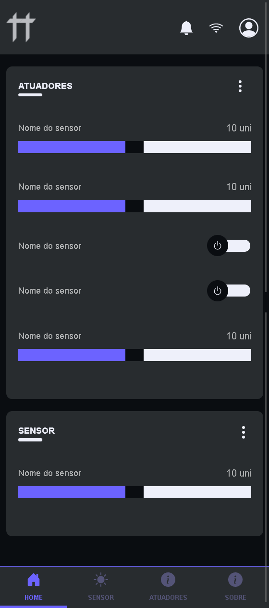
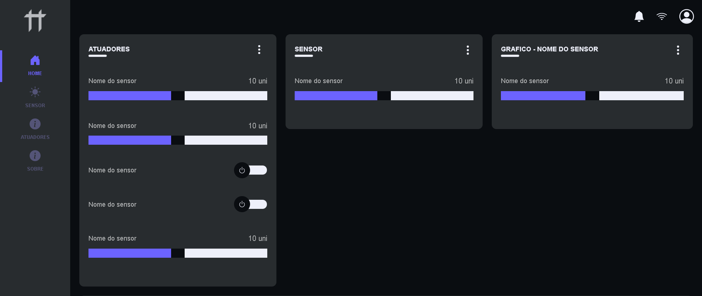

<h1 align="center">
     📱 <a href="#" alt="site do controltt"> ControlTT </a>
</h1>

<h3 align="center">
    🌱 Descrição 💚
</h3>

<p align="center">
	
  &logo=<LOGO>">
  &logo=<LOGO>">

  

  <a href="https://github.com/FlavioInacio-jf/ccontroltt/issues">
    
  </a>
  
  <a href="https://github.com/FlavioInacio-jf/ccontroltt/network">
    
  </a>
    
   <a href="https://github.com/FlavioInacio-jf/ccontroltt/blob/master/LICENSE">
    
  </a>
</p>


<h4 align="center"> 
	🚧  ControlTT 👨🏾‍💻 Em construção... 🚀 🚧
</h4>

<p align="center">
 <a href="#-sobre-o-projeto">Sobre</a> •
 <a href="#-funcionalidades">Funcionalidades</a> •
 <a href="#-layout">Layout</a> • 
 <a href="#-como-executar-o-projeto">Como executar</a> • 
 <a href="#-tecnologias">Tecnologias</a> • 
 <a href="#-autor">Autor</a> • 
 <a href="#user-content--licença">Licença</a>
</p>


## 💻 Sobre o projeto

♻️ Controle de estufa feito em Html, Css.

---

## ⚙️ Funcionalidades

- [x]

---

## 🎨 Layout

O layout da aplicação está disponível no na pasta 'design':


### Layout Mobile

<p align="center">
  
</p>

### Layout Web

<p align="center" style="display: flex; align-items: flex-start; justify-content: center;">
  

</p>

---

## 🚀 Como executar o projeto

Este projeto é divido em três partes:
1. Frontend (pasta web)


### Pré-requisitos

Antes de começar, você vai precisar ter instalado em sua máquina as seguintes ferramentas:
[Git](https://git-scm.com). 
Além disto é bom ter um editor para trabalhar com o código como [VSCode](https://code.visualstudio.com/)


#### 🧭 Rodando a aplicação web (Frontend)

```bash

# Clone este repositório
$ git clone git@github.com:FlavioInacio-jf/README-ccontroltt.git

# Acesse a pasta do projeto no seu terminal/cmd
$ cd README-ccontroltt

# Vá para a pasta da aplicação Front End
$ cd web

## Vá para a pasta da aplicação Front End
$ Clique em index.html
```

---

## 🛠 Tecnologias

As seguintes ferramentas foram usadas na construção do projeto:

#### **Website**  ([Html](https://developer.mozilla.org/pt-BR/docs/Web/HTML)  +  [Css](https://developer.mozilla.org/pt-BR/docs/Web/CSS))
- 

#### [](https://github.com/FlavioInacio-jf/ControlTT#utilit%C3%A1rios)**Utilitários**

-   Protótipo:  **[Adobe XD](https://www.adobe.com/br/products/xd.html)** 
-   Editor:  **[Visual Studio Code](https://code.visualstudio.com/)** 
-   Ícones:  **[Bootstrap Icons](https://icons.getbootstrap.com/)**
-   Fontes:  **[Arial](https://www.fonts.com/font/monotype/arial)**,  **[Helvetica](https://www.fonts.com/font/linotype/helvetica?QueryFontType=Web&src=GoogleWebFonts)**


---

## 💪 Como contribuir para o projeto

1. Faça um **fork** do projeto.
2. Crie uma nova branch com as suas alterações: `git checkout -b my-feature`
3. Salve as alterações e crie uma mensagem de commit contando o que você fez: `git commit -m "feature: My new feature"`
4. Envie as suas alterações: `git push origin my-feature`

---

## 🦸 Autor
 
 <br />
 <sub><b>Flávio Inácio</b></sub>
 <br />

[](https://www.linkedin.com/in/fl%C3%A1vio-in%C3%A1cio/) 
[](mailto:jflavioinacio22@gmail.com)

---

## 📝 Licença

Este projeto esta sobe a licença [MIT](./LICENSE).

Feit por Flávio Inácio 👋🏽 [Entre em contato!](https://www.linkedin.com/in/fl%C3%A1vio-in%C3%A1cio/)
